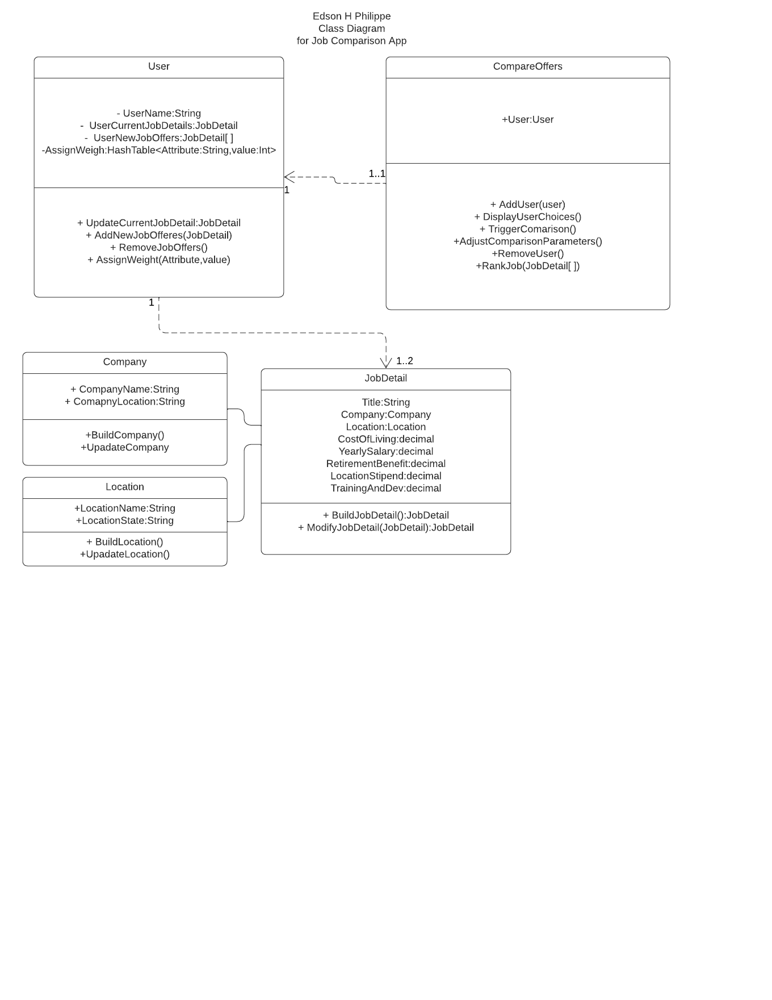
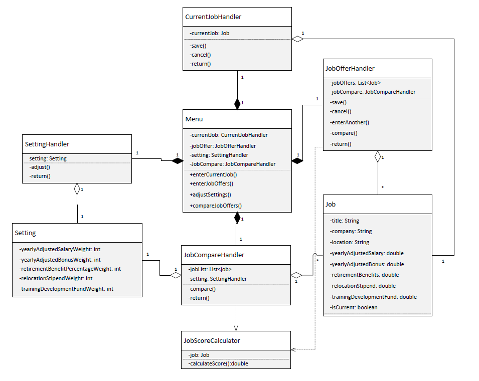
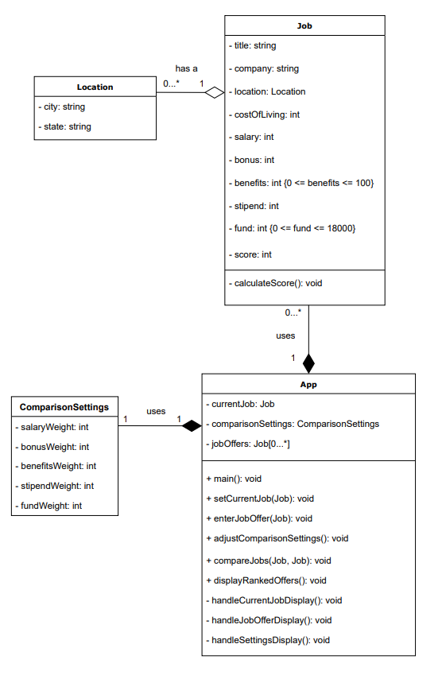
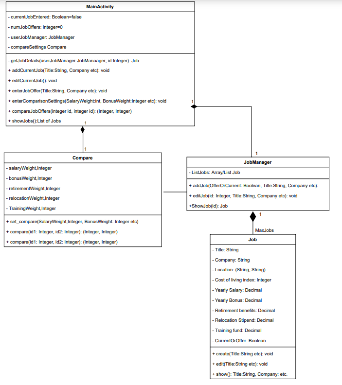
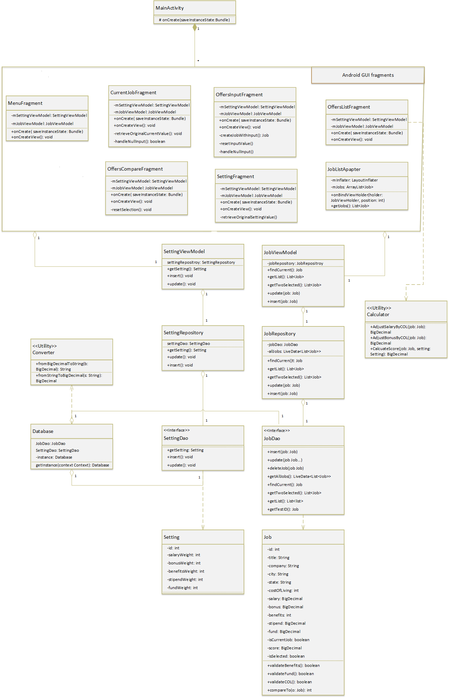

# Individual Designs

## Design 1

* Pros:
  * The design can extend to multiple users.
  * There is a class for a job, and there is an ability to add jobs.

* Cons:
  * User class is unnecessary.
  * There is a CompanyLocation field for Company and a Location class, which seems redundant.
  * Don't see an entry point.
  * Yearly bonus is missing from JobDetail class.
  * Some fields are missing types.
  * User should be able to have anywhere from 0...* jobs.

## Design 2

* Pros:
  * Design feels complete.
  * All classes have required fields.

* Cons:
  * Functions missing return type.
  * 'setting' field in JobCompareHandler should be of type 'Setting'.
  * JobScoreCalculator should potentially be part of JobCompareHandler.

## Design 3

* Pros:
  * Design feels complete.
  * Simple implementation.

* Cons:
  * Needs method for getting current job.
  * 'score' field maybe shouldn't be in Job class as it doesn't account for weights.
  * Values for salary, bonus, etc. should maybe be of decimal/float type.
  * There maybe should not be two different fields for currentJob and jobOffers, as it will require different tables to store in a database.
  * Should maybe breakout functionalities from main() method into separate handler classes.
  * Location-Job relation should probably be 1-to-1

## Design 4

* Pros:
  * Design feels complete.
  * Simplicity of design is nice.

* Cons:
  * compare() function should return a single integer.
  * Duplicate compare() functions in Compare class.
  * Job class should maybe have an id field as job comparison functions use ids.

## Team Design

We began our team design by basing it off of Design 3, and we made modifications based off of things we discussed while going over our individual designs.
Our team design ended up being even simpler than any of the individual designs, only having three separate classes. We also made sure that our team design
was complete by covering all of the issues that our individual designs missed.

We chose to simply handle the functionalities through the App class in order to reduce complexity and to clearly represent the class as the main throughput
of the app's operations. Once that decision was made, we simply needed a Job class to handle storage of any job details entered by the user, as well as a
JobComparison class to store the weights needed to calculate a job's score. We decided to put the calculateScore() method in the JobComparison class as it
would already being holding the comparison settings, and all that would be needed to be passed in to calculate the score would be the job itself.

* Differences:
  * In our team design, a single app class handles all of the functionalities that were otherwise split into multiple classes in our individual designs.
  * Some of the functionalities that our individual designs missed were covered in our team design.
  * In Design 3, we had a separate Location class, while in our team design, we simply saved those values in the Job class as the 'city' and 'state' fields.
* Commonalities:
  * Our team design, like our individual designs, have dedicated classes to represent a Job and the comparison utility.
  * Our team design likewise has a main App class which serves as the focal point for the functionality.

## Summary

We learned the importance of simplifying the design as much as possible, as well as the importance of collaboration as we all noticed issues in other team
members' designs that we didn't notice ourselves as we made them. We learned the importance of giving everyone in the team a voice, as they may have seen
something that the rest of us missed. It was also a good learning experience for some of us, as we hadn't spent time formally planning and creating a design before.
