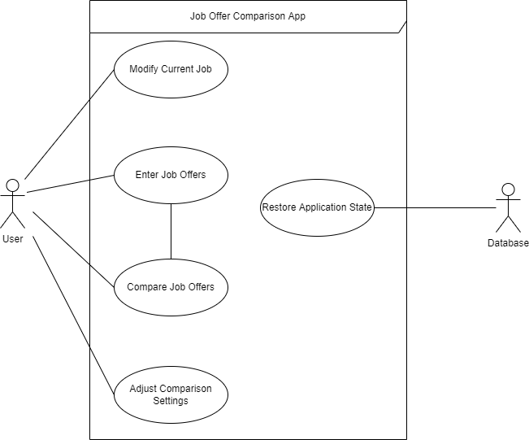

# Use Case Model

**Author:** Team059

## Use Case Diagram

## Use Case Descriptions

### Modify Current Job
- Requirements: this use case must allow the user to enter or edit the details of their current job.
- Pre-conditions: the user has selected the option to enter or edit current job details from the application's main menu.
- Post-conditions: the user is on the application's main menu.
- Scenarios:
    - The user is prompted with nine input fields corresponding to details about their current job.
    - If the user had already previously entered and saved details about their current job, then the input fields will be pre-populated with the
    details of that job.  
    - The user can enter details about their current job or edit the details if they had already previously entered and saved details of their current job.  
    - The user is prompted to also either save their current job or cancel.  
    - If the user attempts to save their current job, but not all of the input fields have been populated, then the application will not save the job.  
    - If the user populates all of the input fields and selects the option to save the job, then the application will save the job details as the current job and 
    the user is brought back to the main menu.  
    - If the user chooses to cancel, they are brought back to the main menu.

### Enter Job Offers
- Requirements: this use case must allow the user to enter the details of a job offer.
- Pre-conditions: the user has selected the option to enter job offers from the application's main menu.
- Post-conditions: the user is back on the main menu, or the user is on a job comparison screen.
- Scenarios:
    - The user is prompted with nine input fields corresponding to details about a job offer.  
    - The user can enter details about a job offer.  
    - The user is prompted to either save the job offer details or cancel.  
    - If the user attempts to save the job offer, but not all of the input fields have been populated, then the application will not save the job.  
    - If the user populates all of the input fields and selects the option to save the job, then the application will save the job details in a job offer list.  
    - If the user chooses to cancel, the input fields will be cleared.  
    - After the user saves a job offer or chooses to cancel, they are prompted to enter another job offer, return to the main menu, or compare their saved offer
        with their current job, if applicable.  
    - If the user chooses to enter another job offer, they will be prompted again with nine input fields corresponding to details about a job offer.  
    - If the user chooses to return to the main menu, they are brought back to the main menu.  
    - If the user has saved a current job and chooses to compared their saved job offer, then the application will show a comparison between the two jobs.

### Compare Job Offers
- Requirements: this use case must allow the user to compare the details of two different jobs.
- Pre-conditions: the user has selected the option to compare job offers from the application's main menu, or the user has selected the option
    to compared the job offer they just saved with their current job, if applicable.
- Post-conditions: the user is shown a table with comparison details between two jobs.
- Scenarios: 
    - If the user has chosen the option to compare job offers from the application's main menu, they will be shown a ranked list of job offers, including
        their current job, if applicable.  
    - The user can then select two jobs from the list and trigger the comparison.  
    - The user is shown a table comparing the details of the two jobs.  
    - The user is prompted to perform another comparison or return to the main menu.  
    - If the user chooses to perform another comparison, they are again show the ranked list of job offers.  
    - If the user chooses to return to the main menu, they are brought back to the main menu.
    - If the user had chosen the option to compare the job offer they had just saved, they are shown a table comparing the details of that
        job offer with the details of their current job.

### Adjust Comparison Settings
- Requirements: this use case must allow the user to adjust the comparison weights used by the application in calculating a job's score.
- Pre-conditions: the user has selected the option to adjust the comparison settings from the application's main menu.
- Post-conditions: the user is back on the main menu.
- Scenarios:
    - The user is prompted with five input fields corresponding to the application's job offer comparison settings.  
    - If the user had not previously changed the comparison settings, the fields are pre-populated with default values.  
    - If the user had previously saved comparison settings, then the fields are pre-populated with those saved values.  
    - The user is prompted to save the comparison settings or cancel.  
    - If the user saves the comparison settings, the application will save the values to reflect the new comparison settings and return the user
        to the main menu.
    - If the user chooses to cancel, they are brought back to the main menu.

### Restore Application State
- Requirements: this use case must allow the application to restore its state from the previous time the user had used the application.
- Pre-conditions: the user opens the application.
- Post-conditions: the application state is restored to match the state at the end of the user's previous session.
- Scenarios:
    - The user opens the application.  
    - The application restores its state from the database so that any current job, job offers, or changes to the comparison settings that the user
        had made during any previous sessions will be repopulated.